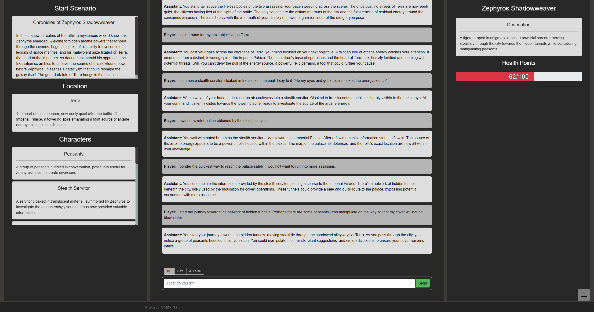

# ChatRPG - Immerse yourself in the ultimate AI-powered adventure!

🌟 Embark on an Unforgettable Journey with ChatRPG! 🌟

Dive into a mesmerizing world where your choices shape a dynamic adventure, fueled by the extraordinary
power of ChatGPT's Large Language Model. ChatRPG offers a limitless realm of exploration, immersing you in
an ever-changing tapestry of fantasy encounters and epic battles. Break free from the ordinary with
unmatched replayability, as the adaptive AI ensures a unique experience in every playthrough.
Whether you crave solo escapades or seek a substitute for Dungeon & Dragons, ChatRPG welcomes you to a
seamless installation of Blazor and C# magic. Answer the call of fantasy—Play ChatRPG today and
let your epic tale unfold! 🚀🗡️🔮

## Features

### AI-Powered Adventure

ChatRPG utilizes the Large Language Model (LLM) offered by ChatGPT to serve as the ultimate game master.
This AI-driven experience allows for dynamic storytelling, creating a personalized and engaging
adventure for each player.

### Endless Exploration

Explore a vast and rich fantasy world filled with mysterious encounters, challenging combat scenarios,
and intriguing NPCs. The AI adapts to your choices, providing a unique experience every time you play.

### Replayability

Unlike traditional Choose-Your-Own-Adventure (CYOA) games, ChatRPG offers unparalleled replayability.
The adaptive AI ensures that no two playthroughs are the same, making each journey into the game a fresh
and exciting experience.

### Singleplayer Mode

For those who can't find a Dungeon & Dragons group or prefer solo adventures, ChatRPG provides a compelling
singleplayer experience. Dive into the world of ChatRPG and embark on quests without the need for a group.

## Getting Started

### 1. Sign Up

To begin your adventure, sign up on our platform. Create an account to track your progress and multiple
characters for diverse playthroughs.

### 2. Choose Your Path

Enter the fantasy world and make choices that shape your character's destiny. Navigate through intriguing
storylines, encounter mythical creatures, and overcome challenges.

### 3. Battle System

Engage in dynamic combat with the AI-powered adversaries. The outcome depends on your decisions, skills,
and a bit of luck. Will you emerge victorious or face the consequences of your choices?

### 4. NPCs and Quests

Interact with diverse non-player characters (NPCs) who offer quests, information, and unique storylines.
Your interactions with NPCs influence the unfolding narrative.

## Installation

Clone the repository and follow the installation instructions to set up the server application powered by
Blazor and C#. Ensure that you have the necessary dependencies installed to enjoy a seamless gaming experience.

1. Clone the repository

```shell
git clone https://github.com/KarmaKamikaze/ChatRPG.git
```

2. Navigate to the project folder and edit the `appsettings.json` configuration file.

```shell
cd ChatRPG/ChatRPG
```

Add your ChatGPT API key to the configuration file:

```json
"ApiKeys": {
"OpenAI": "INSERT API KEY HERE"
},
```

3. Build the project

```shell
dotnet build --configuration Release
```

4. Navigate to the build folder and run the program

**Important**: Please read the *Setting up Entity Framework* section before running the game.

```shell
cd bin/Release/net8.0/
./ChatRPG
```

### Setting up Entity Framework

The data model is managed by Entity Framework Core (EF) using the "Code First" paradigm.

To get started locally, first ensure a postgres server is running on your local machine.
By default, the application connects to the server at `localhost:5432`, expects a database named `chatrpg`, and logs in
with username `postgres` and password `postgres`.
However, this can be changed by adding and customizing the following section to User Secrets:

```json
"ConnectionStrings": {
"DefaultConnection": "Host=[HOST_NAME]:[PORT];Database=[DATABASE_NAME];Username=[USERNAME];Password=[PASSWORD]"
}
```

Once the connection string is set up, ensure the Entity Framework tool is installed by executing the following command
in the ChatRPG project folder:

```shell
dotnet tool install --global dotnet-ef
```

Then use the following command to update (or _migrate_) the database to the latest version (replace `update` with `drop`
for a complete reset):

```shell
dotnet ef database update
```

The database used in the connection string should now be up-to-date and ready for use.

#### Making changes to the data model

Internally, EF uses the migration scripts in `/ChatRPG/Data/Migrations/` to create the data model (tables, constraints,
indices, etc).
Whenever a migration is applied, this is logged in a table named `_EFMigrationHistory` to track the current version of
the (local) data model.

To make changes to the data model, follow these steps:

1. Ensure that your local data model is up-to-date.
2. Make the required changes, e.g. by changing the database context (`/ChatRPG/Data/ApplicationDbContext.cs`), or by
   adding/altering models in `/ChatRPG/Data/Models/`.
3. Run the following command, which will generate a migration named `[DATE_AND_TIME]_[NAME_OF_MIGRATION].cs`:
    ```shell
    dotnet ef migrations add [NAME_OF_MIGRATION]
    ```
4. To apply this migration, run the command:
    ```shell
    dotnet ef database update
   ```

The local data model should then be up-to-date.

## Getting a Glimpse

Explore the visuals of ChatRPG through these snapshots to get a taste of the seamless user interface
and the captivating world that awaits. Dive in, make choices, and let the magic unfold!

#### Landing Page


*Welcome to ChatRPG! The journey begins at our inviting landing page,
setting the stage for the immersive adventures that await.*

#### Dashboard


*Your control center for epic storytelling! The Dashboard lets users configure new campaigns,
track progress, and seamlessly continue previous adventures.*

#### Campaign Gameplay


*Step into the heart of the action! The Campaign Gameplay screen is where fantasy comes to life,
with dynamic storytelling and AI-powered encounters.*

## Contribute

ChatRPG is an open-source project, and we welcome contributions from the community. Whether you're a developer,
storyteller, or designer, there's a place for you in shaping the future of this AI-powered adventure.

1. Fork the repository
2. Create a branch (`git checkout -b feature/AmazingFeature`)
3. Commit your changes (`git commit -m 'Add some AmazingFeature'`)
4. Push to the branch (`git push origin feature/AmazingFeature`)
5. Open a pull request

## License

This project is licensed under the MIT License - see
the [LICENSE](https://github.com/KarmaKamikaze/ChatRPG/blob/master/LICENSE) file for details.

---

Dive into the ultimate AI-powered adventure with ChatRPG!
Create your own story, face mythical challenges, and experience the limitless possibilities that await you.
May your choices shape a legendary tale in the realms of fantasy!
